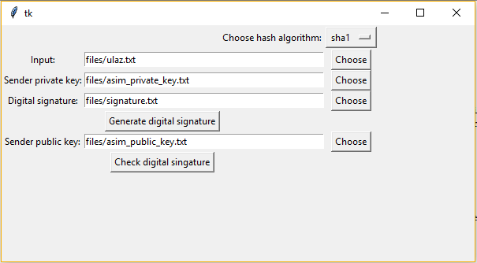

# NOS-labs
Lab assignments for Advanced Operating Systems course FER, UNIZG

- lab1 - Synchronization missionaries and cannibals using message qeueing and synchronization philosophers with Ricart-Agrawal protocol using pipelines for communication.
- lab2 - Program system which supports digital signature, digital envelope and digital seal with options of using different symmetric algorithms, asymmetric algorithms and hash functions. Program system also supports various keys length and cryptographic modes.

##

 

 

